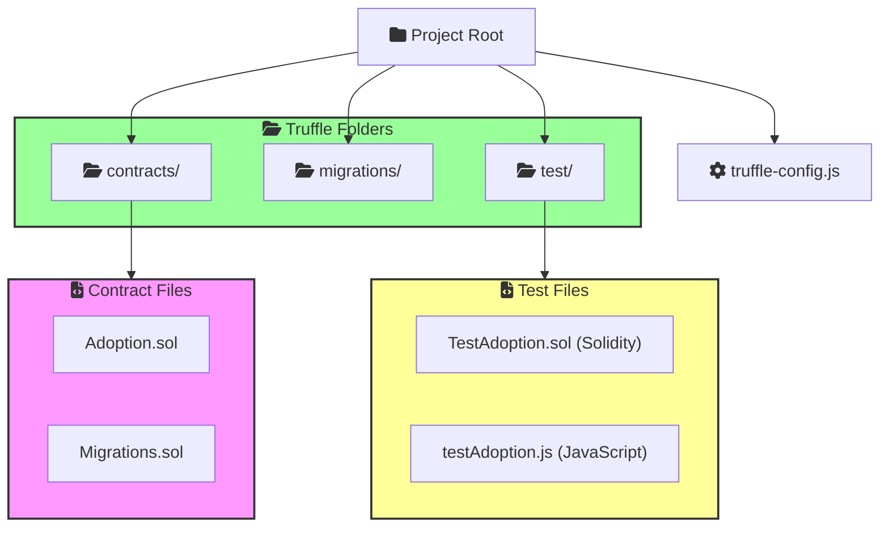
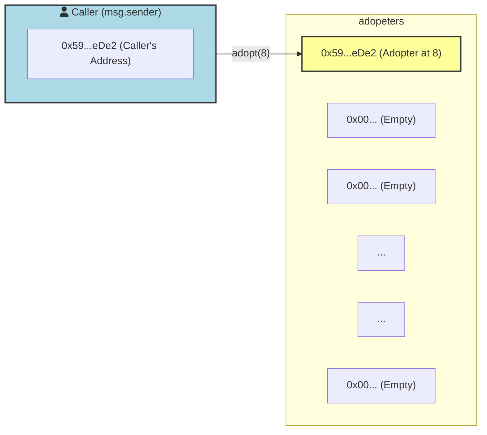
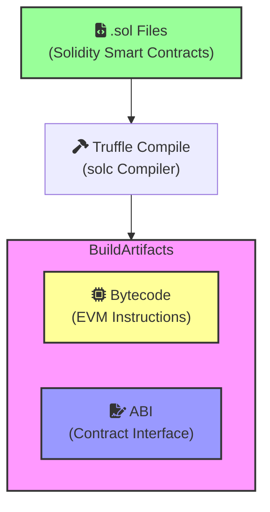
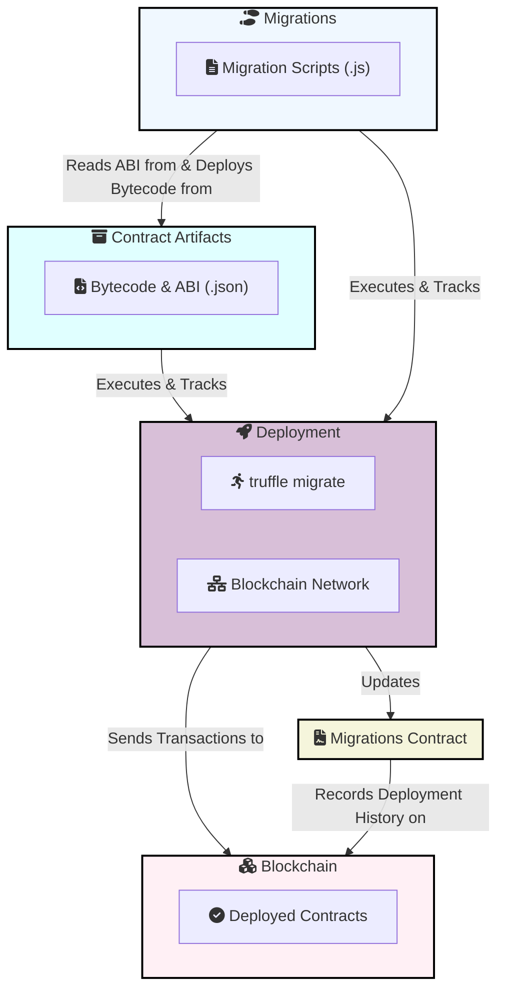
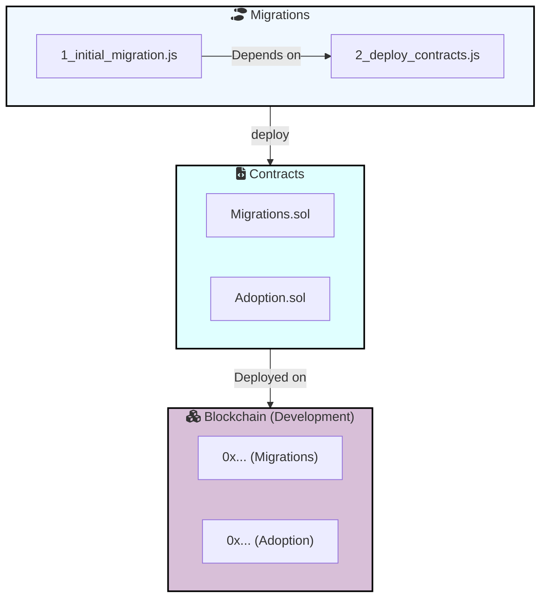
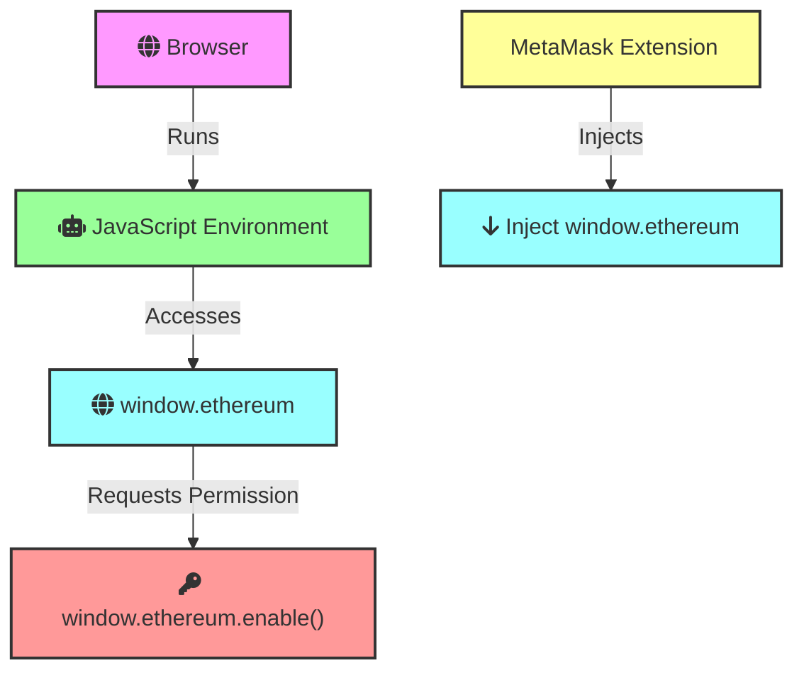
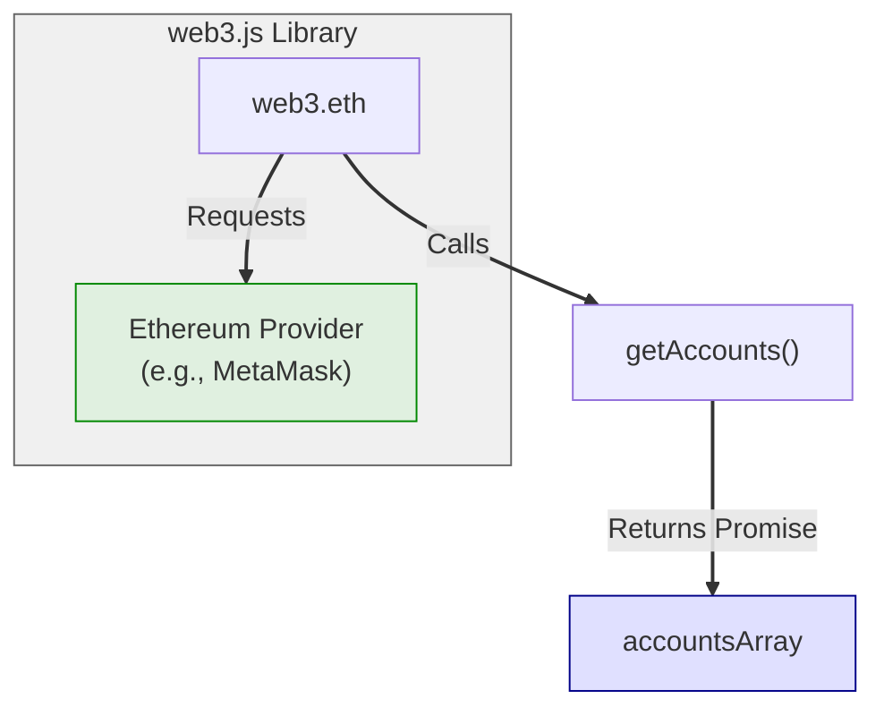
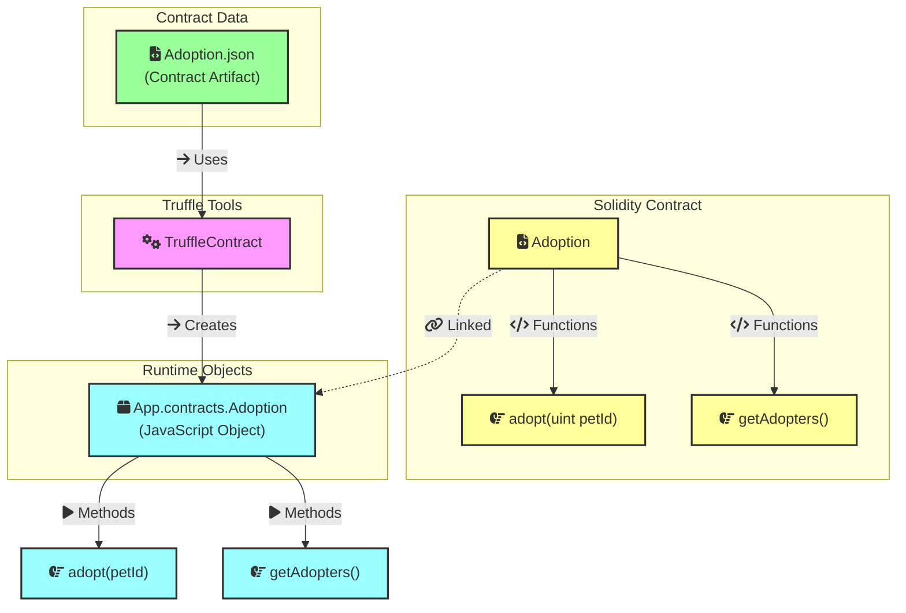
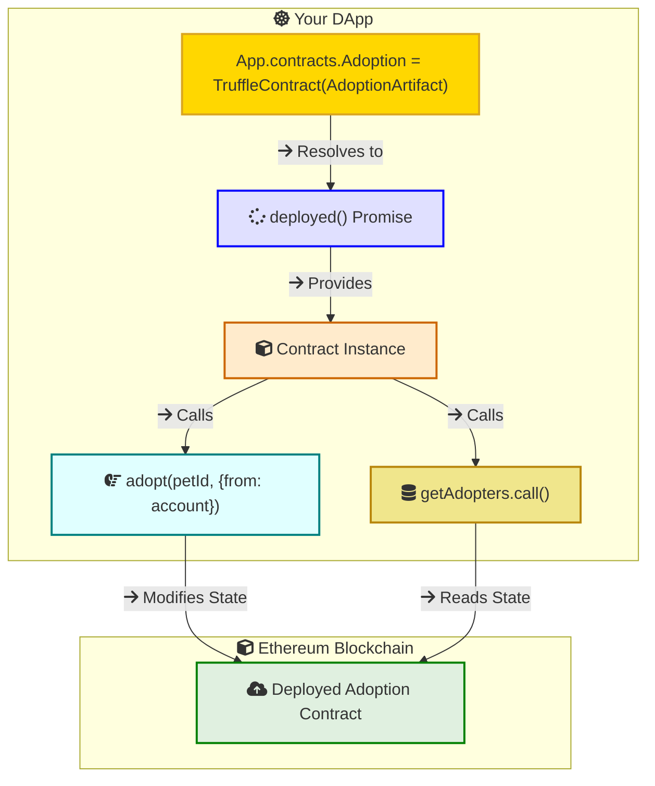
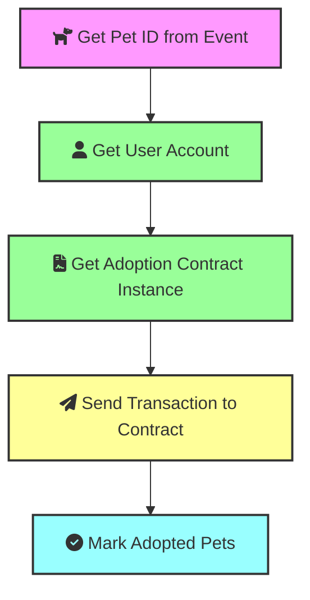

Truffle is the development framework for Ethereum, simplifying smart contract creation, testing, and deployment.

# Smart Contract 
## About the Pet Shop Tutorial

The Truffle Pet Shop tutorial is a great place to start learning about Ethereum development. It's a simple dApp that allows users to adopt pets.

## Setting Up Truffle

Install Truffle globally using npm:
```bash
npm install -g truffle
```

To kickstart your project, begin by unboxing the "pet-shop" example:

```bash
truffle unbox pet-shop
```


## Directory Structure

The directory structure of a Truffle project is similar to the following:




## Create a Contract

```js
// contracts/Adoption.sol
pragma solidity ^0.5.0;

contract Adoption {
  // This specifies an array of 16 elements where each element is of type address.
  address[16] public adopters;
  // Adopting a pet
  function adopt(uint petId) public returns (uint) {
    require(petId >= 0 && petId <= 15);
    adopters[petId] = msg.sender;
    return petId;
  }

  function getAdopters() public view returns (address[16] memory) {
    return adopters;
  }
}
```


This specifies an array of 16 elements where each element is of type address. The address type in Solidity is used to store Ethereum addresses, which are 20-byte values that uniquely identify accounts (both user accounts and contract accounts) on the Ethereum blockchain. `adopters` would typically be used to map pet IDs to the addresses of users who have adopted them.

**Example**:

Make a call to the `adopt` function with the argument `8` to adopt the pet with ID 8. The function will store the address of the account that made the call (msg.sender) in the `adopters` array at index 8.




## Compile the Contract


When you run the truffle compile command, Truffle utilizes the Solidity compiler (`solc`) behind the scenes.
The compiler translates your human-readable Solidity code into a low-level format called bytecode that can be understood and executed by the Ethereum Virtual Machine (EVM).


To compile the contract, run the following command:

```bash
truffle compile
```

After running the compile command, you should see a new build/ directory in your project. This directory contains all the files generated by the compilation process.

**build/contracts/ (Contract Artifacts)**

The compilation process generates JSON files representing your compiled contracts. These files, called "artifacts," are stored in the build/contracts directory of your Truffle project.
Each artifact file contains two crucial components:
Bytecode: This is the binary representation of your contract's code, the set of instructions that the EVM will run on the blockchain.
ABI (Application Binary Interface): This is a JSON object that describes the contract's interface, including its functions, their input parameters, return types, and events. The ABI is essential for interacting with your deployed contract from external applications and tools.


```bash
pet-shop/
├── contracts/
│   └── Adoption.sol
└── build/
    └── contracts/
        ├── Adoption.json   // Contains bytecode and ABI
```

Output similar to the following:

```bash
Compiling your contracts...
===========================
> Compiling ./contracts/Adaption.sol
> Compiling ./contracts/Migrations.sol
> Artifacts written to /Users/kelvinbz/source-code/introduction-web3js/c4-pet-shop/build/contracts
> Compiled successfully using:
- solc: 0.5.16+commit.9c3226ce.Emscripten.clang
```

## Ganache: A Local Blockchain

Ganache is a personal blockchain for Ethereum development you can use to deploy contracts, develop your applications, and run tests.  It acts as a simulated Ethereum network on your local machine, allowing you to test your smart contracts and decentralized applications (dApps) without incurring real costs or risking funds on a live network.

For more information, visit the [Ganache website](https://archive.trufflesuite.com/ganache/).


## Run Migrations



You start by writing migration scripts (JavaScript files) in the migrations/ directory. These scripts define how your contracts should be deployed to the blockchain. Each migration script typically deploys a single contract or performs a specific task.

```javascript
// migrations/2_deploy_contracts.js
var Adoption = artifacts.require("Adoption");
module.exports = function(deployer) {
  deployer.deploy(Adoption);
};
```

Run the following command to migrate your contract to the blockchain:

```bash
truffle migrate
```

you should see output similar to the following:

```bash
Starting migrations...
======================
> Network name:    'development'
> Network id:      5777
> Block gas limit: 6721975 (0x6691b7)


1_initial_migration.js
======================

   Deploying 'Migrations'
   ----------------------
   > transaction hash:    0x9f5053929624c42c11b9216359f0c9fe3d911293f37b71c54fb0c85e5510237a
   > Blocks: 0            Seconds: 0
   > contract address:    0x81634f10231fB77FB5d5f4ECBb6095C348491f40
   > block number:        1
   > block timestamp:     1720926701
   > account:             0x594eAe4dB0BD6AD48C42864f0492CA735017eDe2
   > balance:             99.999347804875
   > gas used:            193243 (0x2f2db)
   > gas price:           3.375 gwei
   > value sent:          0 ETH
   > total cost:          0.000652195125 ETH

   > Saving migration to chain.
   > Saving artifacts
   -------------------------------------
   > Total cost:      0.000652195125 ETH

Summary
=======
> Total deployments:   1
> Final cost:          0.000652195125 ETH


(base) @Kenvinbz c4-pet-shop % truffle migrate

Compiling your contracts...
===========================
> Everything is up to date, there is nothing to compile.


Starting migrations...
======================
> Network name:    'development'
> Network id:      5777
> Block gas limit: 6721975 (0x6691b7)


2_deploy_contracts.js
=====================

   Deploying 'Adoption'
   --------------------
   > transaction hash:    0xd4a7d87e2b5cc7ccfdb011aabee6c8d2b60271bff16916616d1c8a35f1792f10
   > Blocks: 0            Seconds: 0
   > contract address:    0x8cF8593297FB5EA2F01b2aDF8fc29745896955AD
   > block number:        3
   > block timestamp:     1720927011
   > account:             0x594eAe4dB0BD6AD48C42864f0492CA735017eDe2
   > balance:             99.998550649218314381
   > gas used:            203827 (0x31c33)
   > gas price:           3.176737487 gwei
   > value sent:          0 ETH
   > total cost:          0.000647504871762749 ETH

   > Saving migration to chain.
   > Saving artifacts
   -------------------------------------
   > Total cost:     0.000647504871762749 ETH

Summary
=======
> Total deployments:   1
> Final cost:          0.000647504871762749 ETH

```

- **Initial Migration (1_initial_migration.js)**:

This script deploys the `Migrations` contract to your local blockchain (Development network with ID 5777). The Migrations contract is a special contract that helps Truffle track which migrations have already been run.
It cost 0.000652195125 ETH (fake Ether since it's a development network) to deploy, including gas fees.

- **Deploying Contracts (2_deploy_contracts.js)**:

This script deploys your custom `Adoption` contract.
It also cost 0.000647504871762749 ETH on the development network.

- **Gas Used**: check this post [Gas Price and Gas Limit](https://kelvin-bz.github.io/posts/blockchain-for-dummies/#gas-fees)

- **Contract Address**: The contract address is a unique identifier assigned to a smart contract when it is deployed on the Ethereum blockchain. It allows users and other contracts to interact with the deployed contract.
  - `Migrations Contract` was deployed at 0x81634f10231fB77FB5d5f4ECBb6095C348491f40.
  - `Adoption Contract` was deployed at 0x8cF8593297FB5EA2F01b2aDF8fc29745896955AD.

Each time you run truffle migrate, a new contract address will be generated ONLY if you're deploying a NEW contract or a new version of an existing contract.

If you're simply re-running a migration script for an already deployed contract, Truffle will recognize that the contract exists on the blockchain and won't redeploy it, thus the contract address remains the same.





## Test the Contract

Add a new file in the test/ directory called testAdoption.js. This file will contain the test suite for the Adoption contract.

```js
//test/testAdoption.test.js
const Adoption = artifacts.require("Adoption");

contract("Adoption", (accounts) => {
  let adoption;
  let expectedAdopter;

  before(async () => {
    adoption = await Adoption.deployed();
  });

  describe("adopting a pet and retrieving account addresses", async () => {
    before("adopt a pet using accounts[0]", async () => {
      await adoption.adopt(8, { from: accounts[0] });
      expectedAdopter = accounts[0];
    });

    it("can fetch the address of an owner by pet id", async () => {
      const adopter = await adoption.adopters(8);
      assert.equal(adopter, expectedAdopter, "The owner of the adopted pet should be the first account.");
    });

    it("can fetch the collection of all pet owners' addresses", async () => {
      const adopters = await adoption.getAdopters();
      assert.equal(adopters[8], expectedAdopter, "The owner of the adopted pet should be in the collection.");
    });
  });
});

```

- `{ from: accounts[0] }` part specifies the sender of the transaction
- When you call await adoption.adopt(8, { from: accounts[0] });, you are sending a transaction from accounts[0] to the adopt function of the Adoption contract


Run the test suite using the following command:

```bash
truffle test
```

you should see output similar to the following:

```bash
Using network 'development'.


Compiling your contracts...
===========================
> Everything is up to date, there is nothing to compile.


  Contract: Adoption
    adopting a pet and retrieving account addresses
      ✔ can fetch the address of an owner by pet id
      ✔ can fetch the collection of all pet owners' addresses


  2 passing (92ms)
```
# Interface 
## window.ethereum object



The window.ethereum object is injected into the browser's window object by Ethereum-enabled browser extensions or wallets. The most common example is MetaMask. The extension injects the window.ethereum object into the global scope of your browser's JavaScript environment. This makes the object available for your web applications (like DApps) to use.

`window.ethereum.enable()` to request permission from the user to connect their Ethereum accounts to the DApp

## web3.eth.getAccounts()
The `web3.eth` module provides functions to interact with the Ethereum blockchain, including account management, transaction handling, and smart contract interaction.




- **Purpose:** Retrieves Ethereum addresses that the user has authorized your dapp to access.
- **Returns:** A Promise that resolves to an array of strings (Ethereum addresses).
- **Example:**
  ```javascript
  web3.eth.getAccounts().then(accounts => {
    // Use accounts[0] as the user's address
  });
  ```

## TruffleContract() Function



- **Purpose:** The `TruffleContract()` function is a utility provided by the Truffle framework. It takes a contract artifact as input and creates a JavaScript object that represents your smart contract.

- **What It Does:**
  - **Loads ABI:** It parses the ABI from the artifact, allowing your DApp to understand how to interact with the contract's functions.
  - **Connects to Provider:**  You set a Web3 provider to connect this contract object to an Ethereum node or wallet, enabling communication with the blockchain.
  - **Provides Methods:** It dynamically creates JavaScript methods based on the ABI. These methods match the names of the functions defined in your Solidity contract.

- **Example:**
   ```javascript
    // 'adoptionInstance' now lets you call contract functions
    const adoptionInstance = await App.contracts.Adoption.deployed();
    const adopters = await adoptionInstance.getAdopters.call(); 
   ```

You don't have to manually construct complex data structures for function calls or event subscriptions. Truffle handles the low-level details for you. It hides the complexities of the ABI and bytecode, allowing you to focus on the business logic of your DApp.

## Calling Contract Functions



To get the instance of the contract, you can use the `deployed()` function, which returns a promise that resolves to the contract instance. You can then call the contract functions using the instance.

```js
App.contracts.Adoption.deployed().then(function (instance) {
            // Use the contract instance to call functions
        }
```

To adopt a pet, you can call the `adopt()` function on the contract instance by passing the pet ID and the account address.

```js
adoptionInstance.adopt(petId, {from: account})
```

To read data from the blockchain, you can call the `call()` function on the contract instance. This function is used for reading data from the blockchain and does not require a transaction.

```js
adoptionInstance.getAdopters.call();
```

## Click Adopt Button




```js
// src/js/app.js
App = {
    web3Provider: null,
    contracts: {},
    // ...
    bindEvents: function () {
        $(document).on('click', '.btn-adopt', App.handleAdopt);
    },
    ///..
    handleAdopt: function (event) {
        event.preventDefault();
        var petId = parseInt($(event.target).data('id'));
        var adoptionInstance;
        web3.eth.getAccounts(function (error, accounts) {
            if (error) {
                console.log(error);
            }
            var account = accounts[0];
            App.contracts.Adoption.deployed().then(function (instance) {
                adoptionInstance = instance;

                // Execute adopt as a transaction by sending account
                return adoptionInstance.adopt(petId, {from: account});
            }).then(function (result) {
                return App.markAdopted();
            }).catch(function (err) {
                console.log(err.message);
            });
        });

    }
    ///.
}
```

## Prepare MetaMask Wallet

To interact with the DApp in your browser, follow these steps:

1. **Install and Configure MetaMask:**
  - Install the MetaMask browser extension.
  - Import your wallet using the mnemonic from Ganache.
  - Connect MetaMask to the local blockchain at `http://127.0.0.1:7545`.

2. **Install and Configure lite-server:**
  - Ensure `bs-config.json` includes the `./src` and `./build/contracts` directories.
  - Verify that the `package.json` file has a `dev` script that runs `lite-server`.

3. **Start the DApp:**
  - Run `npm run dev` in your terminal to start the local web server and launch the DApp in your browser.
  - You can now interact with the DApp using MetaMask and your local blockchain.

## References

- Read more about Truffle [https://archive.trufflesuite.com/guides/pet-shop/](https://archive.trufflesuite.com/guides/pet-shop/).

- Read the blog post [https://kelvin-bz.github.io/posts/truffle-pet-shop-tutorial/](https://kelvin-bz.github.io/posts/truffle-pet-shop-tutorial/).

